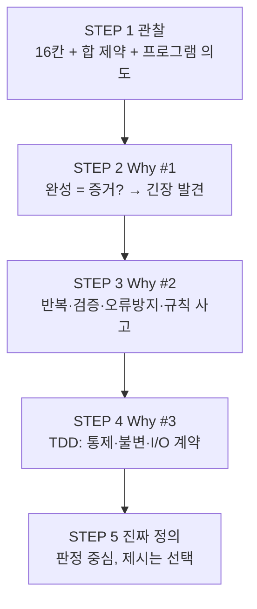

# 4×4 Magic Square — 문제 인식 보고서

| 항목 | 내용 |
|------|------|
| 프로젝트 | MagicSquare_xx |
| 문서 유형 | 문제 인식 (Problem Recognition) |
| 범위 | STEP 1 ~ STEP 5 |
| 작성 기준일 | 2026-05-28 |
| 상태 | 구현·설계·알고리즘 미포함 |

---

## 목차

1. [STEP 1 — Observation (관찰)](#step-1--observation-관찰)
2. [STEP 2 — Why #1](#step-2--why-1)
3. [STEP 3 — Why #2](#step-3--why-2)
4. [STEP 4 — Why #3 (핵심 발견)](#step-4--why-3-핵심-발견)
5. [STEP 5 — 진짜 문제 정의](#step-5--진짜-문제-정의)
6. [종합: 단계 간 연결](#종합-단계-간-연결)

---

## STEP 1 — Observation (관찰)

### 1. 현재 우리가 해결하려는 상황은 무엇인가?

**한 사람이 4×4 격자에 1부터 16까지의 정수를 한 번씩 배치했을 때, 여러 줄·열·대각선의 합이 모두 같아지는 배치를 찾거나 검증·생성하는 과정을, 컴퓨터 프로그램으로 다루고 싶어 하는 상황**이다.

| 관찰 | 의미 |
|------|------|
| 격자 크기가 4×4로 고정 | “임의 크기”가 아니라 **제약이 명확한 소규모 조합 문제** |
| 사용 숫자가 1~16, 중복 없음 | **순열·배치** 문제이면서 동시에 **산술 제약(합 동일)** 문제 |
| 행·열·대각선 합이 같음 | “맞는 배치”의 정의가 **규칙으로 명시**되어 있음 |
| 프로그램으로 다룸 | 사람이 손으로 채우는 것이 아니라 **반복·탐색·검증을 기계에 맡기려는 의도** |

정리하면, 상황은 **“16칸 배치 + 합 일치라는 여러 조건을 동시에 만족하는 상태를, 어떻게 찾고 어떻게 보여줄 것인가”**에 가깝다. 아직은 구현 방법이 정해지지 않은 **문제 정의 직전** 단계이다.

### 2. 왜 4×4 마방진 문제를 다루는가?

**규모**

- 16칸, 1~16 → 전수·탐색·검증을 **손계산·종이·디버깅**으로도 따라갈 수 있는 크기
- 3×3보다 제약이 풍부하고, 5×5 이상보다 **복잡도가 한 단계 올라가는 데 적당**함

**수학·규칙**

- 4×4는 **짝수 차수** 마방진의 대표 사례
- “모든 줄의 합이 같다”는 조건이 **한 줄의 목표 합(마법 상수)**으로 수식화되기 쉬움

**학습·실습**

- 조건 검사, 배열/2차원 구조, 반복, (필요 시) 탐색 등 **프로그래밍 기본기**를 한 문제에 묶기 좋음
- “맞는지 검증”과 “하나를 만들기”를 **역할을 나눠** 설계 연습하기 좋음

**시스템 관점**

- 입력 → 처리 → 출력 같은 **작은 파이프라인**을 연습하기에 부담이 적음

### 3. 어떤 학습 또는 시스템 설계 맥락에서 등장하는가?

**학습 맥락**

- 알고리즘·자료구조: 2차원 구조, 인덱스, 행/열/대각선 순회, 조건 만족 여부 판별
- 문제 해결 절차: 관찰 → 정의 → 모델링 → (이후 단계)
- 수학·논리: 불변량, “해가 여러 개인지/유일한지”
- 소프트웨어 공학 입문: 요구사항, 테스트, 모듈(생성 vs 검증)

**시스템 설계 맥락**

- **도메인 규칙**: “유효한 4×4 배치”의 정의가 곧 비즈니스 규칙
- **검증 vs 생성**: 같은 규칙을 공유하는 두 기능
- **확장 가능성**: 이후 n×n, 부분 격자 검증 등으로 경계 확장 연습
- **관찰 가능성**: 각 줄 합, 마법 상수, 실패한 줄 등을 출력·로그로 드러내는 설계

**상황을 한 문장으로 (관찰 관점)**

> 학습자 또는 개발자가, **고정된 격자와 숫자 집합 위에서 “여러 방향의 합이 같다”는 규칙을 만족하는 배치**를 다루기 위해, 그 규칙을 프로그램이 이해·검증·(필요 시) 탐색할 수 있게 만들려는 **초기 문제 인식** 단계에 있다.

**프로젝트 맥락 (관찰 시점)**

- 작업 공간 `MagicSquare_xx`는 보고서 작성 시점에 구현 산출물 없이 **문제 인식 단계만** 진행된 상태였다.

---

## STEP 2 — Why #1

### Q: 왜 마방진을 완성해야 하는가?

### 가정한 답 (A)

> **“4×4 격자에 1~16을 한 번씩 넣었을 때, 모든 행·열·두 대각선의 합이 같아지는 ‘완성된 배치’가 있어야, 그 배치가 마방진 규칙을 만족한다는 것을 확인할 수 있고, 프로그램의 목적(올바른 결과 제공)을 달성했다고 말할 수 있기 때문이다.”**

즉, **완성 = 규칙 충족의 증거**이고, **미완성 = 성공 여부를 판단할 수 없음**이라는 전제를 둔다.

### A에서 드러나는 불편함·구조적 문제

#### 1. “완성”과 “목적”이 한 가지로 묶여 있음

| 상황 | A만 따르면 |
|------|-----------|
| 사용자가 칸을 직접 채우며 학습 | “아직 완성 안 됨” = 실패처럼 보임 |
| 프로그램이 **검증만** 하면 됨 | “완성”이 필수 목적인지 불명확 |
| 이미 알려진 해를 **출력만** 하면 됨 | “만들기”와 “보여주기”가 같은 이유인지 구분 안 됨 |

**구조적 문제:** *왜 완성해야 하는가*에 대한 답이 **생성·검증·학습·시연**을 한 문장에 합쳐 버려, 나중에 기능을 나누기 어렵다.

#### 2. “완성”의 정의가 암묵적임

- 부분 배치는 어디까지 허용하는가?
- 행만 맞고 대각선은 아직인 경우는 “진행 중”인가 “오류”인가?
- 해가 여러 개일 때, 하나만 내면 “완성”인가?

**불편함:** “완성됐다”의 판정 기준이 흔들리고, **중간 상태** 요구가 뒤늦게 등장한다.

#### 3. 완성이 곧 가치인지, 수단인지 불분명

- **학습:** 과정이 가치일 수 있음 → 완성은 **부산물**
- **알고리즘 실습:** 탐색 **과정**이 가치 → 완성은 **검증용 결과**
- **제품:** “유효한 마방진인지 검사”만 필요 → 완성 **생성**은 필수가 아님

**구조적 문제:** “왜 완성해야 하는가”에 **가치**가 빠져 있어, 요구 변경 시 첫 번째 Why가 무너진 것처럼 느껴진다.

#### 4. 실패·불가능에 대한 자리가 없음

- 탐색 실패, 불가능한 부분 배치, “완성 못 함”을 **언제·어떻게** 알릴지 정의되지 않음

**불편함:** 성공 경로만 정의되어 **미완성·불가능** 설계가 뒤처진다.

#### 5. 사람의 “완성”과 기계의 “완성”이 충돌할 수 있음

| 관점 | “완성”의 의미 |
|------|----------------|
| 사람 | 패턴·대칭이 맞아 보임 |
| 프로그램 | 모든 줄 합 동일, 1~16 각 1회 |

**구조적 문제:** “거의 맞음”(한 줄만 틀림) 상태가 설계 밖으로 밀린다.

#### 6. 검증 가능성과 생성 부담이 뒤섞임

A의 핵심은 **“규칙을 만족함을 확인”**에 가깝다. “완성해야 한다”는 표현은 **반드시 새로 만들어야 한다**는 뉘앙스를 준다.

**불편함:** Why #1이 **생성 의무**까지 끌고 가면 작은 연습 문제가 **불필요하게 큰 시스템**으로 커질 위험이 있다.

### Why #1 요약

```text
[가정 A]
  완성된 격자 = 규칙 만족의 증거 = 프로그램 성공

[드러난 긴장]
  ① 완성이 목적인가, 검증·학습의 부산물인가?
  ② “완성”의 판정·중간 상태·다중 해를 정의하지 않음
  ③ 실패·진행 중·거의 맞음에 대한 설계 자리 없음
  ④ “만들기”와 “맞는지 확인하기”가 하나의 Why에 묶임
```

---

## STEP 3 — Why #2

### Q: 왜 단순 계산이 아니라 프로그램으로 구현하는가?

### 1. 반복 가능성 (Repeatability)

**관찰:** 손 계산은 실행마다 속도·순서·기록 방식이 달라질 수 있다. 프로그램은 **같은 입력·같은 규칙**이면 **같은 절차**를 다시 실행할 수 있다.

| 손 계산 | 프로그램 |
|--------|----------|
| 한 번 풀고 끝나기 쉬움 | N번, 다른 초기 격자에도 동일 절차 적용 |
| “다시 해보기” 부담 증가 | 반복 실행 비용이 거의 일정 |
| 과정이 머릿속·메모에만 남음 | 과정·결과를 **재현 가능한 형태**로 남기기 쉬움 |

**답:** 같은 규칙으로 **여러 번·여러 경우**를 다루려면 기계적 반복이 구조적으로 유리하다.

**긴장:** “반복”이 목표면 **무엇을 반복할지**(생성 / 검증 / 둘 다)가 분리되지 않으면 범위가 커진다.

### 2. 검증 자동화 (Automated Verification)

**관찰:** “맞다”의 기준은 규칙의 나열이다. 항목이 많을수록 사람은 빠뜨리기 쉽다.

**프로그램이 하는 일(개념):** 격자를 읽고 → 행/열/대각선 합 계산 → 목표 합과 비교; 1~16 사용·중복 검사; 실패 시 **어느 줄이 틀렸는지** 보고.

**답:** 완성 여부를 **주관적 확신**이 아니라 **규칙 목록에 대한 일괄 판정**으로 바꾸려면 검증 자동화가 자연스럽다.

**긴장:** 실제 핵심이 **“완성을 만드는 것”보다 “완성 여부를 기계적으로 증명하는 것”**일 수 있다 → **검증만**으로도 Why #2 상당 부분 충족.

### 3. 오류 방지 (Error Prevention)

**관찰:** 흔한 오류 — 중복·누락, 한 줄만 확인, 산술 실수, 인덱스 밀림.

**답:** **규칙을 한곳에 모아 매번 전부 적용**함으로써 실수 가능 지점을 줄인다. “거의 맞은” 격자에서 한 줄만 틀린 경우를 드러내기 쉽다.

**긴장:** 프로그램도 논리 오류는 낼 수 있다. **검증 로직 자체의 정확성**도 별도 요구가 된다.

### 4. 규칙 기반 사고 훈련 (Rule-Based Thinking Practice)

**관찰:** 마방진은 **명시적 규칙의 집합**이다.

**답:** 단순 계산은 **결과**에 머무르기 쉽고, 프로그램은 **규칙을 실행 가능한 형태로 고정**해야 하므로 규칙 분해·조합·검증 사고를 훈련하기에 적합하다.

**긴장:** 규칙 사고만 목표면 **과도한 기능**은 산만해질 수 있다 → **최소 규칙 + 검증 + (선택) 생성** 정도가 적절한지 다음 단계에서 맞춰야 한다.

### Why #2 종합

> **4×4 마방진을 프로그램으로 다루는 이유는, 같은 규칙을 여러 번·여러 입력에 재현하고(반복), “맞음”을 규칙 전체로 판정하며(검증 자동화), 실수를 줄이고(오류 방지), 규칙을 명시·실행 가능하게 만드는 훈련(규칙 기반 사고)을 하기 위해서이다.**

```text
Why #1 (완성해야 한다)     →  “무엇이 성공인가”
Why #2 (프로그램이어야 한다) →  “왜 사람·종이로는 부족한가”

우선순위 후보:
  ① 검증 자동화 + 오류 방지
  ② 반복 가능성 (다중 케이스·생성 시)
  ③ 규칙 기반 사고 (학습 목표; 범위 조절 기준)
```

---

## STEP 4 — Why #3 (핵심 발견)

### Q: 왜 이 문제를 TDD 방식으로 설계하려 하는가?

### 1. 무엇이 통제되어야 하는가?

| 통제 대상 | 왜 통제하는가 |
|-----------|----------------|
| **유효성 판정** | “마방진인가?” 기준 흔들림 방지 |
| **숫자 집합** | 1~16 각 1회 위반 시 무효 |
| **합 일치** | 행·열·대각선 각각 목표 합과 일치 |
| **경계·형태** | 4×4가 아니면 문제 정의 변경 |
| **생성 vs 검증** | 책임 분리 |
| **회귀** | 변경 후에도 알려진 올바른 격자 유지 |

**핵심 발견:** 통제 1순위는 **검증 로직의 정확성**이고, 그다음이 생성·탐색이다.

### 2. 어떤 불변 조건이 존재하는가?

#### (A) 완성된 격자 (최종 상태)

| 불변 조건 | 내용 |
|-----------|------|
| **집합 불변** | 16칸 = {1, …, 16} 각 1회 |
| **합 불변** | 모든 행·열·두 대각선 합 = M |
| **M = 34** | 4×4, 1~16에서 유도 |
| **선택적 구조 패턴** | 특정 구성법을 요구할 때만 추가 불변 |

#### (B) 생성·탐색 중간 상태

| 불변 조건 | 주의 |
|-----------|------|
| 부분 집합, 미사용 수 | 과정용 |
| “지금까지 채운 줄만” 합 검사 | 최종 불변과 동일하지 않음 — 거짓 실패 주의 |

#### (C) 모듈·계약 경계

| 불변 조건 | 내용 |
|-----------|------|
| 판정 결정성 | 동일 입력 → 동일 결과 |
| 제시-판정 일치 | 제시한 배치는 항상 판정 통과 |
| 실패 명시 | 침묵 실패 금지 |

### 3. 왜 입력/출력이 명확해야 하는가?

**입력이 명확해야 하는 이유**

- 빈 칸 표현, 부분 vs 완성 격자, 생성 요청의 의미가 흐리면 테스트가 명세가 되지 않음

**출력이 명확해야 하는 이유**

- 만족/불만족, (선택) 어느 줄이 틀렸는지, 생성 시 판정 통과 여부가 고정되어야 Why #1의 “완성 = 증거”가 시스템 안에서 재현됨

### Why #3 종합

> **규칙·불변량·판정이 분명한 문제이므로, TDD로 통제 대상·불변·입출력 계약을 먼저 고정하면, 구현 방식을 바꿔도 “마방진이냐”는 의미가 흔들리지 않기 때문이다.**

```text
        [TDD가 고정하는 것]
              │
    ┌─────────┼─────────┐
    ▼         ▼         ▼
 통제      불변 조건   I/O 계약
(검증·회귀) (M=34 등)  (격자 → 판정/결과)
```

**다음 긴장 (STEP 5로 전달)**

1. 검증만 먼저 TDD vs 생성까지 동시에
2. 알려진 해 제시만으로도 판정 테스트는 통과 가능 — “생성의 어려움”은 별도 명세
3. 부분 격자 포함 시 복잡도 급증

---

## STEP 5 — 진짜 문제 정의

### 1. 표면 문제 정의 (잘못된 정의)

> **“4×4 격자에 1부터 16까지 숫자를 넣어서, 행·열·대각선 합이 같은 마방진을 완성하는 프로그램을 만든다.”**

| 문제 | 설명 |
|------|------|
| 목적 과다 | 생성·출력·학습·시연이 한 문장에 섞임 |
| 성공 기준 불명확 | “완성”의 의미 불분명 |
| 역할 미분리 | 판정 vs 새 배치 획득 |
| 입력·상태 무시 | 부분 채움, 잘못된 입력 |
| 실패·경계 없음 | 불만족·진행 중 미정의 |
| 검증 가치 누락 | “맞다”의 근거·주체 없음 |

### 2. 개선된 문제 정의 (정확한 정의)

> **고정된 규모(4×4)와 고정된 숫자 집합(1~16, 각각 정확히 한 번) 위에서, “모든 행·모든 열·두 대각선의 합이 하나의 동일한 값과 같다”는 조건을 만족하는 배치인지를 일관되게 판정하고, 필요할 때만 그 조건을 만족하는 배치를 제시할 수 있어야 한다. 판정 기준은 명시적이며 재현 가능하고, 판정 결과는 동일 입력에 대해 항상 같아야 한다.**

| 요소 | 내용 |
|------|------|
| **대상** | 4×4 배치, 1~16 각 1회(완성 상태 요건) |
| **규칙** | 4행·4열·2대각선 합 동일 |
| **핵심 능력 1** | 주어진 배치 **판정** |
| **핵심 능력 2 (선택)** | 규칙 만족 배치 **제시** — 제시물은 판정 통과 필수 |
| **품질** | 판정 결정성, 규칙과 검사 일치 |

**의도적으로 비우는 것:** 획득 방식, 해 개수, UI, n×n 일반화.

### 3. 이 문제의 핵심 Invariant

#### 최종 상태

| ID | Invariant |
|----|-----------|
| **I1** | 16개 값 = {1, …, 16} |
| **I2** | 네 행·네 열·두 대각선 합 모두 동일 |
| **I3** | 공통 합 = 34 |
| **I4** | “규칙 만족” 인정 배치는 I1~I3 충족 |

#### 시스템·계약

| ID | Invariant |
|----|-----------|
| **I5** | 동일 입력 → 동일 만족/불만족 |
| **I6** | (제시 시) 제시 배치는 판정 통과 |
| **I7** | 불만족 시 침묵 성공 없음 |

#### 비-Invariant (혼동 방지)

- 특정 대칭·구성 방법 (요구에 없으면 불변 아님)
- “한 줄만 맞음” (최종 불변 아님)
- “대각선 제외” (별도 문제 정의)

### 4. 우리가 실제로 훈련하려는 사고 능력

| # | 사고 능력 | 내용 |
|---|-----------|------|
| **1** | 규칙 명시화 | “마방진”을 검사 가능한 조건 목록으로 분해 |
| **2** | 불변량 인식 | “합 동일”과 “합 = 34”를 연계된 진실로 다룸 |
| **3** | 판정과 생성의 분리 | 확인 vs 획득; 제시물은 판정에 종속 |
| **4** | 계약적 입출력 사고 | 무엇을 넣으면 무엇이 나와야 하는지 합의 |
| **5** | 검증 우선·회귀 의식 | 의미를 먼저 고정, 변경이 의미를 깨지 않게 유지 |

### STEP 5 대비 요약

| 구분 | 표면 정의 | 개선 정의 |
|------|-----------|-----------|
| 중심 | 만든다 / 완성한다 | 판정한다; (선택) 제시한다 |
| 성공 | 격자 채움 | 규칙 만족이 재현 가능하게 확인됨 |
| 실패 | 정의 밖 | 불만족이 명시적으로 드러남 |
| 학습 | 결과 맞추기 | 규칙·불변·계약 사고 |

---

## 종합: 단계 간 연결



| 단계 | 핵심 산출 |
|------|-----------|
| STEP 1 | 상황: 제약 명확한 4×4 배치 문제, 구현 전 |
| STEP 2 | “완성” 단독 Why는 모호 → 검증·생성 분리 필요 |
| STEP 3 | 프로그램 가치 = 검증·반복·규칙 명시 |
| STEP 4 | TDD로 판정·불변(I1~I7)·계약 고정 |
| STEP 5 | 진짜 문제 = **판정** (+ 선택적 **제시**) |

### 권장 다음 단계 (본 보고서 범위 외)

- **범위 한 줄 확정:** 판정만 / 제시 포함 / 부분 격자 포함 여부
- 그 후: 요구 명세 → 테스트 목록 → 구현 (별도 문서)

---

## 문서 이력

| 버전 | 일자 | 내용 |
|------|------|------|
| 1.0 | 2026-05-28 | STEP 1~5 대화 내용 통합 초판 |

---

*본 보고서는 구현 설계, 코드, 알고리즘을 포함하지 않는다.*
