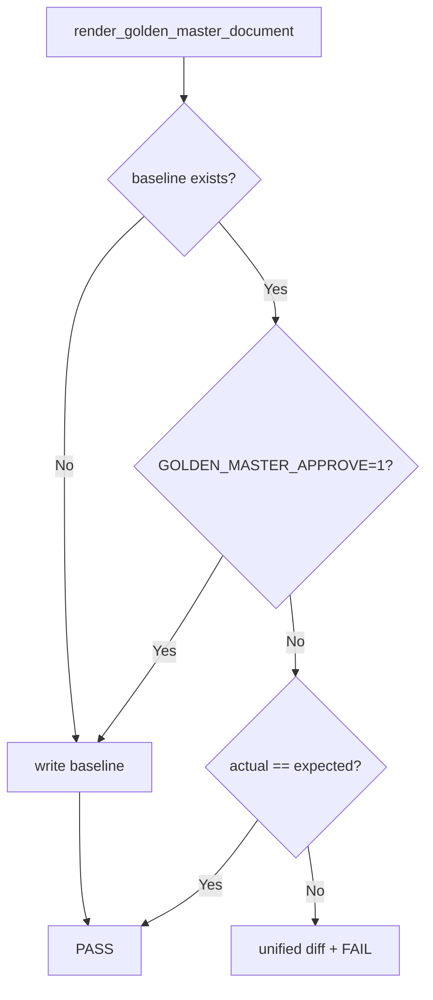

# Golden Master (Approval) Regression — Design

| 항목 | 내용 |
|------|------|
| 문서 ID | GM-1 |
| 대상 | Magic Square Solver end-to-end 출력 회귀 |
| 테스트 ID | `tests/golden_master/test_golden_master.py::test_gm_1_solver_output_matches_golden_master` |
| 기준 파일 | `tests/golden_master_expected.txt` |
| 생성 스크립트 | `scripts/generate_golden_master.py` |

---

## 1. 목적

솔버의 **실제 출력**을 고정 baseline과 비교해, 의도하지 않은 출력 변경을 조기에 감지한다.  
단위 테스트가 개별 규칙을 검증한다면, Golden Master는 **통합 결과 문자열**의 회귀를 담당한다.

---

## 2. 캡처 전략

| 항목 | 선택 |
|------|------|
| 진입점 | `PuzzleBoundary.submit()` (Boundary → Control → Entity) |
| 성공 출력 | `int[6]` 솔루션을 `[r1,c1,n1,r2,c2,n2]` 형식으로 직렬화 |
| 오류 출력 | `ErrorResponse.code` (예: `E002`, `E005`, `DOMAIN_NO_SOLUTION`) |
| stdout | 미사용 (CLI 부재; DTO 직렬화가 SSOT) |

성공/오류 모두 Boundary 계약을 그대로 반영하므로 ECB 경계를 유지한다.

---

## 3. 시나리오 (5종)

| 테스트 ID | 섹션 태그 | 의미 | 입력 요약 |
|-----------|-----------|------|-----------|
| GM-TC-01 | `[GM-TC-01]` | Attempt 1 (small-first) 성공 | G0 파생 2-blank 퍼즐 |
| GM-TC-02 | `[GM-TC-02]` | Attempt 2 (reverse) 성공 | 2-blank 퍼즐 (small-first 실패) |
| GM-TC-03 | `[GM-TC-03]` | 빈칸 개수 위반 | 0개 blank → `E002` |
| GM-TC-04 | `[GM-TC-04]` | 비-zero 중복 | `5` 중복 → `E005` |
| GM-TC-05 | `[GM-TC-05]` | Domain 불가 | `G3` → `DOMAIN_NO_SOLUTION` |

테스트 파일: `tests/golden_master/test_golden_master_magic_square.py`

실행:

```bash
pytest -m golden_master -v
```

---

## 4. 기준 파일 구조

각 시나리오는 아래 블록으로 구성한다. 시나리오 간에는 빈 줄 1개로 구분한다.

```text
[scenario_name]
Input:
<4 rows, space-separated cells>
Output:
[r1,c1,n1,r2,c2,n2]
```

오류 시:

```text
[scenario_name]
Input:
<grid>
Error:
<ERROR_CODE>
```

예시 (`tests/golden_master_expected.txt` 일부):

```text
[GM-TC-01]
Input:
16 3 2 13
5 10 11 8
9 6 0 12
4 15 0 1
Output:
[3,3,7,4,3,14]
```

---

## 5. Approve 패턴



| 상태 | 동작 |
|------|------|
| 기준 파일 **없음** | 현재 출력을 baseline으로 **자동 생성** 후 PASS |
| 기준 파일 **있음** | `actual` vs `expected` 문자열 비교 |
| **불일치** | `difflib.unified_diff` 출력 후 `AssertionError` |
| **의도적 갱신** | `GOLDEN_MASTER_APPROVE=1 pytest ...` 또는 생성 스크립트 실행 |

### Baseline 갱신 방법

```bash
# 방법 1: 전용 스크립트 (권장)
python scripts/generate_golden_master.py

# 방법 2: approve 환경 변수
set GOLDEN_MASTER_APPROVE=1
pytest tests/golden_master/test_golden_master.py -v
```

갱신 후 `tests/golden_master_expected.txt`를 커밋한다.

---

## 6. 모듈 배치

```
tests/golden_master/
├── __init__.py
├── scenarios.py      # GM-TC-01..05 입력 + kind/error code
├── serializer.py     # PuzzleBoundary 실행 + API result serialization
├── parser.py         # baseline section 추출
├── validators.py     # int[6], 1-index, row-major, ordering, error contract
├── approve.py        # approve/compare + unified diff
└── test_golden_master_magic_square.py

scripts/
└── generate_golden_master.py

tests/golden_master_expected.txt   # 버전 관리 대상 baseline
```

---

## 7. 오류 코드 매핑 (PRD alias)

| 시나리오 태그 | PRD alias | 실제 Boundary code |
|---------------|-----------|---------------------|
| `invalid_blank_count` | `INVALID_EMPTY_COUNT` | `E002` |
| `duplicate_number` | `INVALID_DUPLICATE` | `E005` |
| `no_valid_solution` | `DOMAIN_NO_SOLUTION` | `DOMAIN_NO_SOLUTION` |

Golden Master는 **실제 Boundary 응답 code**를 baseline에 기록한다.

---

## 8. CI 권장

1. `tests/golden_master_expected.txt`가 저장소에 포함되어 있는지 확인
2. `pytest tests/golden_master/ -v` 실행
3. 실패 시 diff를 CI 로그에 출력하고, 의도된 변경인 경우만 스크립트로 baseline 재생성 후 PR에 포함

---

## 9. 한계

- GUI(PyQt) 표시 문자열은 본 Golden Master 범위 **외**
- baseline은 **고정 5시나리오**만 포함; 새 시나리오는 `scenarios.py` + baseline 재생성 필요
- 솔버 알고리즘 변경 시 baseline 갱신이 정상적인 워크플로
